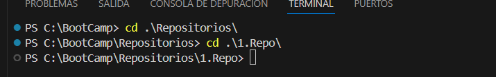
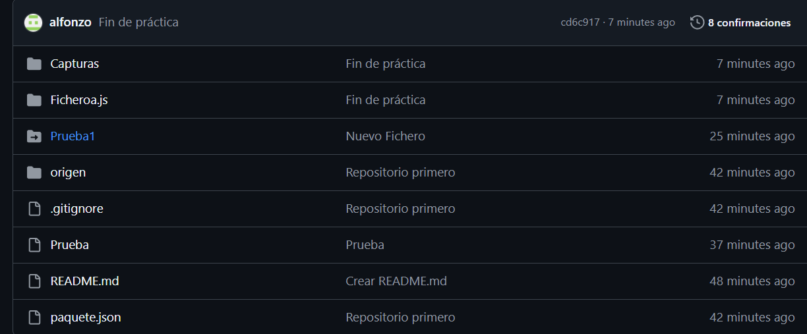
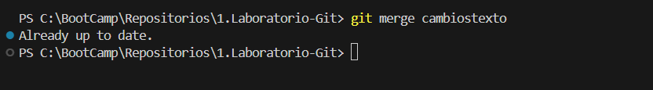

# Laboratorio Git
## 1.Crear un repositorio local

1. Abra su terminal y navegue hasta el directorio donde desea crear el repositorio.

    

2. Cree una carpeta con el nombre del repositorio.

    

3. Ingresa a la carpeta que acabas de crear.

    

4. Inicializa el repositorio de Git.

    

## 2.Subir el repositorio a GitHub

1. Crea un nuevo repositorio en GitHub.

    

2. Copia la URL del repositorio que acabas de crear en GitHub

    

3. Conecta tu repositorio local con el repositorio en GitHub.

    

    

    

4. Verifique que la conexión se haya establecido correctamente.

    

## 3.Hacer un commit y un push

1. Crea un archivo en la carpeta del repositorio.

    

2. Añade el archivo al staging.

    

3. Crea un commit con un mensaje descriptivo.

    

4. Sube los cambios al repositorio en GitHub.

    

## 4.Crea una rama

1. Crea una rama nueva llamada "desarrollo".

    

2. Cambia a la nueva rama.

    

3. Realice algunos cambios en el archivo que crea.

    

4. Agrega y haz un commit con los cambios en la rama "desarrollo"

    

5. Sube los cambios a Github.

    

## 5.Hacer una fusión

1. Vuelve a la rama "main".

    

2. Haz un merge de la rama "desarrollo" a la rama "principal"

    

    

3. Si no hay conflictos, los cambios realizados en la rama "development" se incorporarán a la rama "main"

    

4. Hax un push de los cambios al repositorio en GitHub.

    

